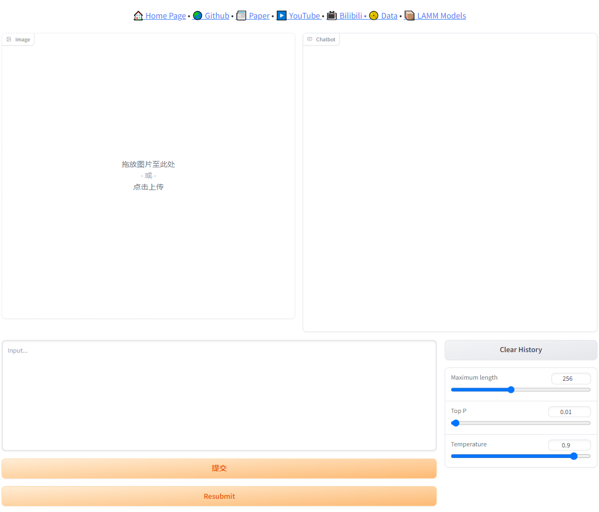

# Demos

## Online Demo

For cases of 2D images, we provide an [online demo](https://huggingface.co/spaces/openlamm/LAMM) deployed on huggingface spaces.

```
Due to limitation of hardware capacity, online version only supports LLM of 7B parameters and load pretrained model takes few minutes.
```

<!-- <a href="https://huggingface.co/spaces/openlamm/LAMM"><p align="center"></p></a>  -->
[](https://huggingface.co/spaces/openlamm/LAMM)

## CLI Demo

We also provide a CLI demo for local test. 
Point cloud data are required to be in format of `npy`, we suggest to use data from LAMM-Benchmark-3D.


```bash
    cd ./src
    python cli_demo.py \
        --model lamm_peft \
        --vision_type pcl or image \
        --encoder_pretrain epcl or clip \
        --encoder_ckpt_path $EPCL_CKPT_PATH or '' \
        --vicuna_ckpt_path $LLM_CKPT_PATH \
        --delta_ckpt_path $LAMM_CKPT_PATH
```