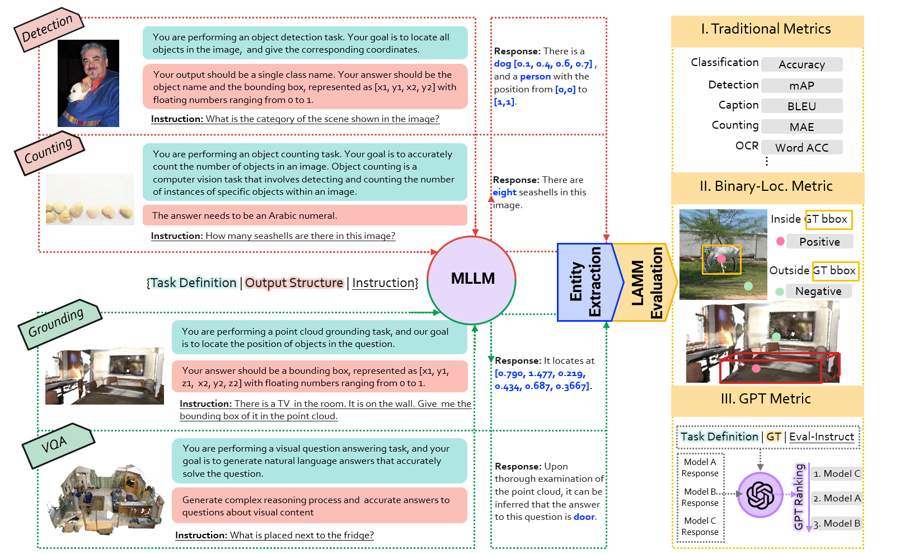

# LAMM-Benchmark

**LAMM-Benchmark** evaluates 9 common image tasks, using a total of 11 datasets with over **62,439** samples, and 3 common point cloud tasks, by utilizing 3 datasets with over **12,788** data samples, while existing works only provide quantitative results on fine-tuning and evaluating specific datasets such as ScienceQA, and most works only conduct demonstration or user studies. 
- We are the very first attempt to establish a benchmark for MLLMs. We conducted a comprehensive benchmark to quantify the zero-shot and fine-tuning performance of existing multi-modal language models on various computer vision tasks and compare them against state-of-the-art methods of these tasks, including classification, object detection, pose estimation, visual question answering, facial classification, optical character recognition, object counting. 
- We also attempted two novel evaluation strategies designed explicitly for MLLMs. Specifically, as for text generation, we established a scoring logic based on the GPT API. As for tasks involving interactions between points and images, such as object detection and pose estimation, we proposed an object-locating evaluation method.



## Data & Model Preparation for LAMM-Benchmark
Benchmark Data For Evaluation

### 2D_Benchmark data

|  Meta file name  | size  |  Image file name | size |  
|  ----  | ----  |  ----  | ----  |  
| [Caption_flickr30k.json](https://huggingface.co/datasets/openlamm/LAMM_Dataset/blob/main/2D_Benchmark/meta_file/Caption_flickr30k.json)  | 598K | flickr30k_images.zip | 559M |     
| [Classification_CIFAR10.json](https://huggingface.co/datasets/openlamm/LAMM_Dataset/blob/main/2D_Benchmark/meta_file/Classification_CIFAR10.json)  | 2.6M | cifar10_images.zip  | 8.9M  |  
| [Counting_FSC147.json](https://huggingface.co/datasets/openlamm/LAMM_Dataset/blob/main/2D_Benchmark/meta_file/Counting_FSC147.json) | 7.3M | fsc147_images.zip   |  44M |  
| [Detection_VOC2012.json](https://huggingface.co/datasets/openlamm/LAMM_Dataset/blob/main/2D_Benchmark/meta_file/Detection_VOC2012.json) | 6.4M | voc2012_images.zip  | 196M  |  
| [Facial_Classification_CelebA(Hair).json](https://huggingface.co/datasets/openlamm/LAMM_Dataset/blob/main/2D_Benchmark/meta_file/Facial_Classification_CelebA(Hair).json) | 2.4M | celeba_images.zip  |  566M |  
| [Facial_Classification_CelebA(Smile).json](https://huggingface.co/datasets/openlamm/LAMM_Dataset/blob/main/2D_Benchmark/meta_file/Facial_Classification_CelebA(Smile).json) | 3.7M |  celeba_images.zip  |  566M |  
| [Fine-grained_Classification_UCMerced.json](https://huggingface.co/datasets/openlamm/LAMM_Dataset/blob/main/2D_Benchmark/meta_file/Fine-grained_Classification_UCMerced.json) | 676K | ucmerced_images.zip  | 317M  |  
| [Keypoints_Dectection_LSP.json](https://huggingface.co/datasets/openlamm/LAMM_Dataset/blob/main/2D_Benchmark/meta_file/Keypoints_Detection_LSP.json) | 3.9M |  fsc147_images.zip   |  44M |   
| [Locating_FSC147.json](https://huggingface.co/datasets/openlamm/LAMM_Dataset/blob/main/2D_Benchmark/meta_file/Locating_FSC147.json) | 7.5M | fsc147_images.zip   |  44M |  
| [Locating_LSP.json](https://huggingface.co/datasets/openlamm/LAMM_Dataset/blob/main/2D_Benchmark/meta_file/Locating_LSP.json) | 3.9M | lsp_images.zip  |  9.9M |  
| [Locating_VOC2012.json](https://huggingface.co/datasets/openlamm/LAMM_Dataset/blob/main/2D_Benchmark/meta_file/Locating_VOC2012.json) | 6.0M | voc2012_images.zip  | 196M  |  
| [OCR_SVT.json](https://huggingface.co/datasets/openlamm/LAMM_Dataset/blob/main/2D_Benchmark/meta_file/OCR_SVT.json) | 68K |  svt_images.zip  | 82M  |  
| [VQA_AI2D.json](https://huggingface.co/datasets/openlamm/LAMM_Dataset/blob/main/2D_Benchmark/meta_file/VQA_AI2D.json) | 2.1M | ai2d_images.zip  | 559M  |  
| [VQA_SQAimage.json](https://huggingface.co/datasets/openlamm/LAMM_Dataset/blob/main/2D_Benchmark/meta_file/VQA_SQAimage.json) | 3.6M |  sqaimage_images.zip  | 127M  |  

### 3D_Benchmark data 

|  Meta file name  | size  |  Image file name  | size  |  
|  ----  | ----  |  ----  | ----  |   
|  [Detection_ScanNet.json](https://huggingface.co/datasets/openlamm/LAMM_Dataset/blob/main/3D_Benchmark/meta_file/Detection_ScanNet.json)  | 1.7M  | scannet_pcls.zip  | 246M  | 
|  [VG_ScanRefer.json](https://huggingface.co/datasets/openlamm/LAMM_Dataset/blob/main/3D_Benchmark/meta_file/VG_ScanRefer.json)  | 3.7M  | scannet_pcls.zip  | 246M  | 
|  [VQA_ScanQA_multiplechoice.json](https://huggingface.co/datasets/openlamm/LAMM_Dataset/blob/main/3D_Benchmark/meta_file/VQA_ScanQA_multiplechoice.json)  | 859K  | scannet_pcls.zip  | 246M  | 

### Dataset Structure

    ├── 2D_Benchmark  
    │   ├── ai2d_images.zip  
    │   ├── celeba_images.zip  
    │   ├── cifar10_images.zip  
    │   ├── flickr30k_images.zip  
    │   ├── fsc147_images.zip  
    │   ├── lsp_images.zip  
    │   ├── sqaimage_images.zip  
    │   ├── svt_images.zip  
    │   ├── ucmerced_images.zip  
    │   ├── voc2012_images.zip  
    │   └── meta_file  
    │       ├── Caption_flickr30k.json  
    │       ├── Classification_CIFAR10.json  
    │       ├── Counting_FSC147.json  
    │       ├── Detection_VOC2012.json  
    │       ├── Facial_Classification_CelebA(Hair).json  
    │       ├── Facial_Classification_CelebA(Smile).json  
    │       ├── Fine-grained_Classification_UCMerced.json  
    │       ├── Keypoints_Dectection_LSP.json  
    │       ├── Locating_FSC147.json  
    │       ├── Locating_LSP.json  
    │       ├── Locating_VOC2012.json  
    │       ├── OCR_SVT.json  
    │       ├── VQA_AI2D.json  
    │       └── VQA_SQAimage.json  
    └── 3D_Benchmark  
        ├── scannet_pcls.zip  
        └── meta_file  
            ├── Detection_ScanNet.json  
            ├── VG_ScanRefer.json  
            └── VQA_ScanQA_multiplechoice.json


### Model Preparation

- Language Model: Vicuna

    To prepare the pre-trained Vicuna model, please follow the instructions provided [Here](https://github.com/lm-sys/FastChat/tree/main#vicuna-weights). Put the downloaded model in the `./model_zoo/vicuna_ckpt` folder.

- 3D Encoder: EPCL

    Download Pre-trained EPCL model to tokenize point cloud from [Here](https://huggingface.co/openlamm/epcl_vit-L_256tokens/tree/main). Put the downloaded models in the `./model_zoo/epcl_ckpt` folder.

- LAMM Models

    Download LAMM model from [Here](https://github.com/OpenLAMM/LAMM/tree/main#lamm-models). Put the downloaded models in the `./ckpt` folder.

    Or you can train your own LAMM model by following the instructions [Here](https://github.com/OpenLAMM/LAMM/tree/main#Training)!

- Other Models
    - [LLaVA](https://github.com/haotian-liu/LLaVA)
    - [MiniGPT-4](https://github.com/Vision-CAIR/MiniGPT-4)
    - [mPLUG-owl](https://github.com/X-PLUG/mPLUG-Owl)


## Evaluation 

### Inference trained models on 2D tasks

```Bash
cd src
sh scripts/inference_2D.sh
or
sh scripts/inference_2D_slurm.sh       # for slurm
```
Inference & Evaluation on 2D tasks

```Bash
sh scripts/LAMM_2D_Evaluation.sh
```

or 
```Bash
sh scripts/LAMM_2D_Evaluation_slurm.sh  # for slurm
```
    
 
### Inference trained models on 3D tasks

```Bash
cd src
sh scripts/inference_3D.sh
```
or
``` Bash
sh scripts/inference_3D_slurm.sh       # for slurm
```

### Inference & evaluation trained models on 3D tasks

```Bash
sh scripts/LAMM_3D_Evaluation.sh
```
or 
```Bash
sh scripts/LAMM_3D_Evaluation_slurm.sh  # for slurm
```


### Evaluation for other MLLM models. 

Please refer to [LLaVA](https://github.com/haotian-liu/LLaVA), [MiniGPT-4](https://github.com/Vision-CAIR/MiniGPT-4) and [mPLUG-owl](https://github.com/X-PLUG/mPLUG-Owl) for inference respectively. Save the answers in `./answers`. And then run `common_eval_2d.py` for evaluation. For example, to evaluate LLaVA on VOC2012:

```Bash
python common_eval_2d.py \
--dataset-name VOC2012 \
--answer-file ./answers/LLaVA \
--base-data-path ./data/LAMM-Dataset/2D_Benchmark \
2>&1 | tee ./results/LLaVA/eval_VOC2012.log
```

### GPT Metric

Make sure that you have finished the inference of all the evaluation dataset for both your model/LAMM model and the MLLM model to compare. For example, to rank LAMM and LLaVA: 
```Bash
sh scripts/GPT_metric.sh
```
You may need to dive into scripts to change datasets to evaluation & checkpoints folder to load.

## Leaderboard


### Results of LAMM model on selected 2D vision tasks

| Task                       | Dataset  | LAMM(Zero-Shot) | LAMM(Finetune) |
| -------------------------- | -------- | --------------- | -------------- |
| Classification **(Acc)**   | CIFAR10  | 37.90            | 91.2           |
| Object Detection **(Acc)** | VOC2012  | 7.20            | 13.48          |
| VQA **(mAP@0.5)**          | SQAimage | 49.88           | 74.27          |


### Results of 3D tasks by LAMM

| Task                                         | Dataset   | SOTA  | LAMM (Zero-Shot) | LAMM (Finetune) |
| -------------------------------------------- | --------- | ----- | ---------------- | --------------- |
| 3D Object Detection **(mAP@0.5)**            | ScanNet   | 63.2  | 8.2              | 11.89           |
| Visual Grounding **(mAP@0.5)**               | ScanRefer | 54.59 | Failed           | 3.38            |
| 3D VQA **(Acc of multiple choice prolblem)** | ScanQA    | N/A   | 24.90            | 99.89           |


### Comparison of results of Binary Locating Metric and GPT Metric of existing MLLMs 


|                   | [LLaVA](https://github.com/haotian-liu/LLaVA) | [MiniGPT4](https://github.com/Vision-CAIR/MiniGPT-4) | [mPLUG-owl](https://github.com/X-PLUG/mPLUG-Owl) | LAMM            |
| ----------------- | ----- | -------- | --------- | --------------- |
| Binary-Loc Metric | 14.73 | 13.12    | 4.42      | **<u>36.53</u>** |
| GPT Metric        | 11    | -        | -         | **<u>89</u>**   |


### Comparison of Multimodal Large Language Models on 2D computer vision tasks.

 Bold fonts for the best results.

| Task                  | Dataset                         | Metric     | SOTA           | [LLaVA](https://github.com/haotian-liu/LLaVA)                        | [MiniGPT4](https://github.com/Vision-CAIR/MiniGPT-4)                    | [mPLUG-owl](https://github.com/X-PLUG/mPLUG-Owl)         | LAMM                                  |
| --------------------- | ------------------------------- | ---------- | -------------- | ---------------------------- | --------------------------- | ----------------- | ------------------------------------- |
| Classification        | CIFAR10                         | Acc ↑      | 99.5           | **60.83**                    | 46.22                       | 42.5              | 37.9                                  |
| Detection             | VOC2012                         | mAP ↑      | 97.2           | 1.42                         | 0.92                        | 0.158             | **<u>7.20</u>**                       |
| VQA                   | SQAimage<br />AI2D              | Acc ↑      | 92.53<br />N/A | 40.5<br />18.13              | 43.43<br />Failed           | 36.39<br />19.31  | **<u>49.88</u>**<br />**<u>20.92</u>** |
| Image Caption         | flickr30k                       | BLEU4 ↑    | 30.1           | **<u>6.65</u>**              | 5.1                         | 2.74              | 2.56                                  |
| F-g clasification     | UCMerced                        | Acc ↑      | 100            | **<u>47</u>**                | 33.6                        | 32.5              | 18.23                                    |
| Counting              | FSC147                          | MAE ↓      | 10.79          | 56.2                         | Failed                      | 60.67             | **<u>46.88</u>**                      |
| OCR                   | SVT                             | Word Acc ↑ | 97.9           | **<u>37.78</u>**             | 16.97                       | 30.39             | 29.14                                   |
| Facial Classification | CelebA(Smile)<br />CelebA(Hair) | Acc ↑      | N/A<br />N/A   | Failed<br />46.42 | **<u>66.36</u>**<br />43.47 | Failed<br />40.93 | 57.60<br /> **<u>56.96</u>**                       |
| Keypoints Detection   | LSP                             | PCK ↑      | 99.5           | Failed                       | Failed                      | Failed            | Failed                                |
