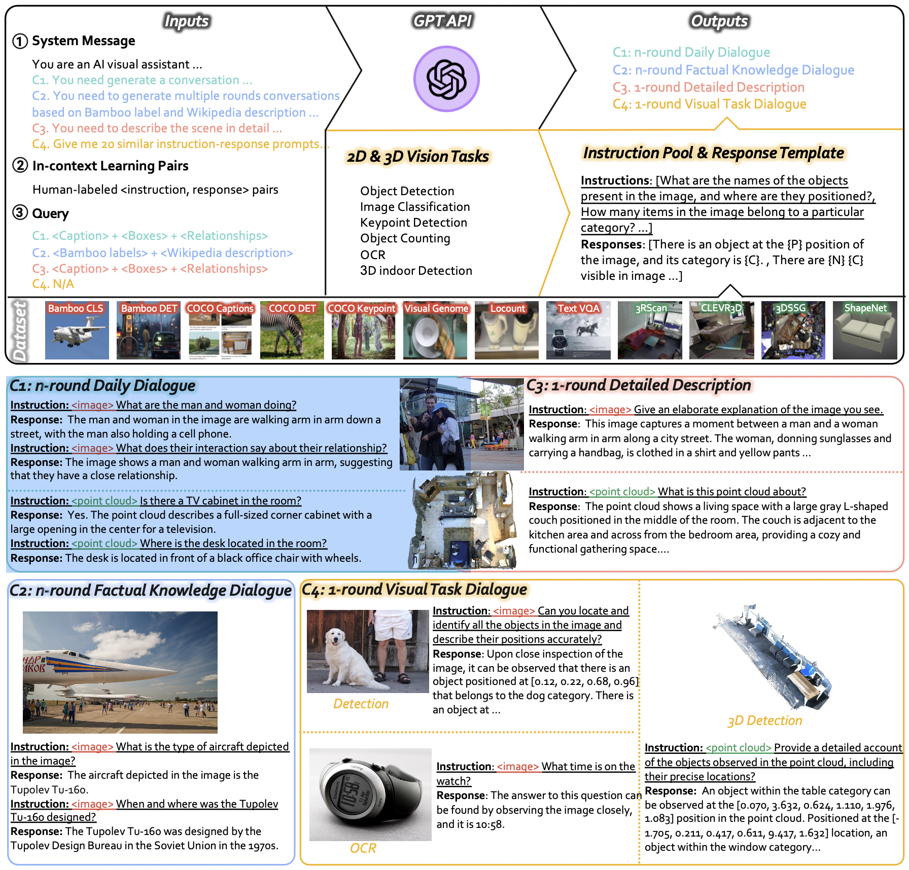

# LAMM-Dataset

LAMM-Dataset is a comprehensive multi-modal instruction tuning dataset, which contains 186K language-image instruction-response pairs, and 10K lanuage-3D instruction-response pairs.In LAMM-Dataset, the instruction-response pairs are gathered from 8 image datasets and 4 point cloud datasets. Here we design four type of multi-modal instruction-response pairs, 
- C1: n-round daily dialogue focuses on multi-modal daily conversations. 
- C2: n-round factual knowledge dialogue aims at factual knowledge reasoning. 
- C3: 1-round detailed description aims to elaborate images and 3D scenes in texts. 
- C4: 1-round visual task dialogue transfers various vision tasks into instruction-response pairs, aiming at enhancing generalizability towards domain tasks in other modalities.



## Download 

Download LAMM-Dataset from [here](https://opendatalab.com/LAMM/download).

 If you would like to download the entire LAMM Dataset and LAMM Benchmark, you can do so from the opendatalab website using the provided [LAMM link](https://opendatalab.com/LAMM/download). Here is the table illustrating the correspondence between each Meta file and image collection in the LAMM dataset:

 ### Instruction Data For Training
 #### 2D_Instruct data 

|  Meta file name  | size  |  Image file name |  size |  
|  ----  | ----  |  ----  | ---- |   
| [daily_dialogue_49k.json](https://huggingface.co/datasets/openlamm/LAMM_Dataset/blob/main/2D_Instruct/meta_file/daily_dialogue_49k.json)  | 112M | coco_images.zip | 7.8G |   
| [detailed_description_49k.json](https://huggingface.co/datasets/openlamm/LAMM_Dataset/blob/main/2D_Instruct/meta_file/detailed_description_49k.json)  | 65.5M |  coco_images.zip | 7.8G |    
| [factual_knowledge_dialogue_42k.json](https://huggingface.co/datasets/openlamm/LAMM_Dataset/blob/main/2D_Instruct/meta_file/factual_knowledge_dialogue_42k.json) | 83.2M | bamboo_images.zip | 5.4G |  
| [vision_task_dialogue_46k.json](https://huggingface.co/datasets/openlamm/LAMM_Dataset/blob/main/2D_Instruct/meta_file/vision_task_dialogue_46k.json) | 64.8M | coco_images.zip, bamboo_images.zip, locount_images.zip, textvqa_images.zip | 9.2G |  

#### 3D_Instruct data

|  Meta file name  | size  |  Image file name  | size  |  
|  ----  | ----  | ----  | ----  | 
|  [LAMM_3dinstruct_10k.json](https://huggingface.co/datasets/openlamm/LAMM_Dataset/blob/main/3D_Instruct/meta_file/LAMM_3dinstruct_10k.json)  | 19.6M  | 3rscan_pcls.zip  | 720M  |  
|  |  | shapenet_pcls.zip  | 209M  |  

## Dataset Structure

    └── 2D_Instruct  
    │   ├── coco_images.zip  
    │   ├── bamboo_images.zip  
    │   ├── textvqa_images.zip  
    │   ├── locount_images.zip  
    │   └── meta_file  
    │       ├── daily_dialogue_49k.json  
    │       ├── detailed_description_49k.json  
    │       ├── factual_knowledge_dialogue_42k.json  
    │       └── vision_task_dialogue_46k.json  
    └── 3D_Instruct  
        ├── 3rscan_pcls.zip  
        ├── shapenet_pcls.zip  
        └── meta_file  
            └── LAMM_3dinstruct_10k.json  


## Meta file format

### For images
```json
[
    {
    "id": "000000019028",  # image id
    "image": "coco_images/000000019028.jpg", # image path
    "conversations": [
        {
            "from": "human",  # instruction
            "value": "How is the kitchen in the image furnished?"
        },
        {
            "from": "gpt",  # response
            "value": "The kitchen in the image is furnished with white cabinets and white appliances. There is a dishwasher, a stove, and a sink. On the stove, a blue towel hangs on the handle. A cutting board is placed on the dishwasher. There are also additional elements like a bowl of apples on the counter and a beige rug on the floor."
        }
    ],
    "task_type": "conversation",  # task type
    "src_image": "coco2017" # original dataset
    },
    {
        ...
    }
]
```
### For point cloud
```json
[
    {
        "pcl": "shapenet_pcls/04256520_cb71cb7b36dbcb6f826fc8d57346a2e4_4096.npy",
        "conversations": [
                {
                    "from": "human",
                    "value": "What scenario does this point cloud belong to according to the model\u2019s prediction?"
                },
                {
                    "from": "gpt",
                    "value": "Through meticulous analysis, it becomes evident that the point cloud aligns with the characteristics of sofa,couch,lounge s       cenario."
                }
            ],
        "task_type": "classification3d",
        "src_dataset": "ShapeNet",
        "src_id": "04256520_cb71cb7b36dbcb6f826fc8d57346a2e4"
    },
    {
        ...
    }
]
```

**Notes**：

1. If you want to work with a specific subset of the LAMM dataset, you will need to download both the corresponding meta file and the image collection. 
2. if you prefer to download the data from the official website yourself, you can still organize it in the same way as we have and run it successfully. For example, during the 2D instruction tuning stage, if you only want to run the daily_dialogue_49k.json file, you can download the [COCO2017](http://images.cocodataset.org/zips/train2017.zip) dataset and organize it accordingly.
