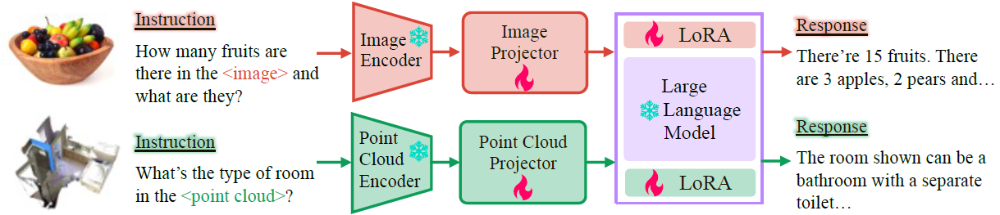

# LAMM-Framework

## Installation

Pre-requist Packages: `gcc <= 7.5.0; nvcc >= 11.1`


```bash
    conda create -n lamm python=3.10 -y
    conda activate lamm
    # Choose different version of torch according to your 
    conda install pytorch==1.12.1 torchvision==0.13.1 torchaudio==0.12.1 cudatoolkit=11.3 -c pytorch
```
Install required packages
```bash
    pip install -r requirements.txt

    # Optional; For 3D experiments ONLY
    cd src/model/EPCL/third_party/pointnet2/
    python setup.py install
    cd ../../utils/
    pip install cython
    python cython_compile.py build_ext --inplace
```
Download required NLTK data
```python
    import nltk
    nltk.download('stopwords')
    nltk.download('punkt')
    nltk.download('wordnet')
```

## Data & Model Preparation for Training
- Data
    
    Follow [Download](https://github.com/OpenLAMM/LAMM/tree/readme#download) to download and prepare the data for 2D and 3D tasks. Put downloaded data in `./data` folder.
    ```
    ├── data
        ├── 2D_Instruct  
        ├── 3D_Instruct
    ```

- Language Model: Vicuna

    To prepare the pre-trained Vicuna model, please follow the instructions provided [Here](https://github.com/lm-sys/FastChat/tree/main#vicuna-weights). Put the downloaded model in the `./model_zoo/vicuna_ckpt` folder.

- 3D Encoder: EPCL

    Download Pre-trained EPCL model to tokenize point cloud from [Here](https://huggingface.co/openlamm/epcl_vit-L_256tokens/tree/main). Put the downloaded models in the `./ckpt` folder.


## Training
### 2D Models Training

```Bash
cd src
sh scripts/train_lamm2d.sh
or
sh scripts/train_lamm2d_slurm.sh       # for slurm
```
### 3D Models Training
```Bash
cd src
sh scripts/train_lamm3d.sh
or
sh scripts/train_lamm3d_slurm.sh       # for slurm
```
You need to dive into scripts to change data path and other hyper-parameters. 

For your reference, GPU memory consumption for different models are shown as follows

| Model Size | Sample Num/GPU | GPU Memory | 
| :----------: | :---------------------: | :------------------: |
|Vicuna_v0_7B | 1 | ~30GB |
|Vicuna_v0_7B | 2 | ~46GB |
|Vicuna_v0_13B | 1 | ~53GB |
|Vicuna_v0_13B | 2 | ~70GB |