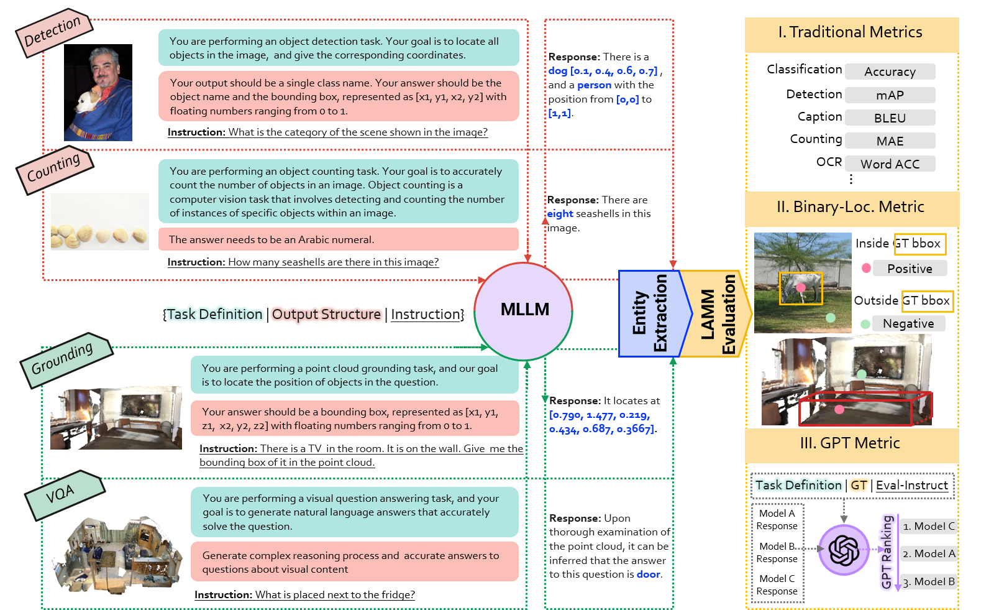

# LAMM-Benchmark
**LAMM-Benchmark** evaluates 9 common image tasks, using a total of 11 datasets with over **62,439** samples, and 3 common point cloud tasks, by utilizing 3 datasets with over **12,788** data samples, while existing works only provide quantitative results on fine-tuning and evaluating specific datasets such as ScienceQA, and most works only conduct demonstration or user studies.

We are the very first attempt to establish a benchmark for MLLMs. We conducted a comprehensive benchmark to quantify the zero-shot and fine-tuning performance of existing multi-modal language models on various computer vision tasks and compare them against state-of-the-art methods of these tasks, including classification, object detection, pose estimation, visual question answering, facial classification, optical character recognition, object counting.
We also attempted two novel evaluation strategies designed explicitly for MLLMs. Specifically, as for text generation, we established a scoring logic based on the GPT API. As for tasks involving interactions between points and images, such as object detection and pose estimation, we proposed an object-locating evaluation method.

