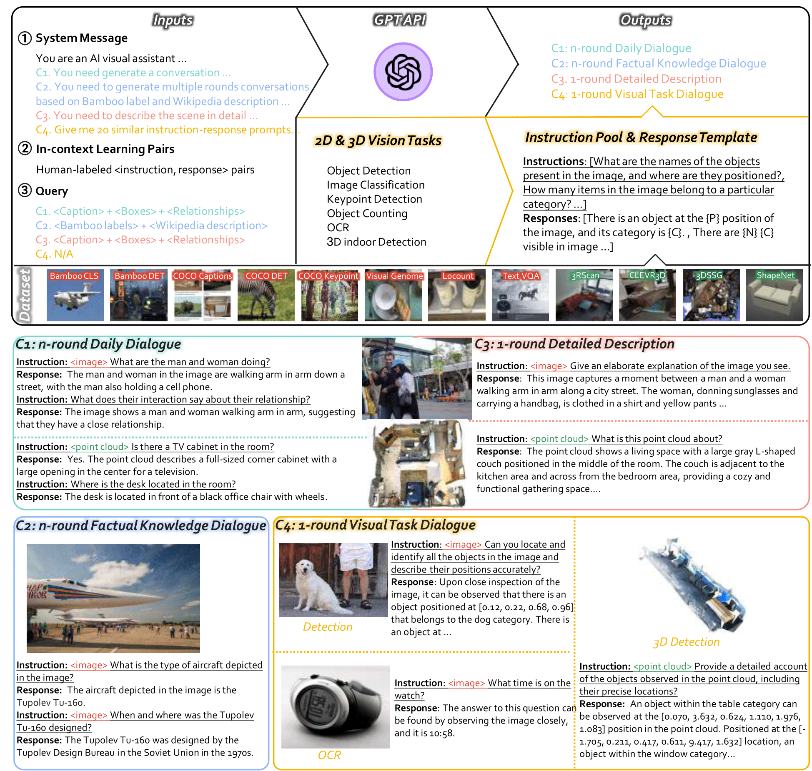

# LAMM-Dataset
**LAMM-Dataset** is a comprehensive multi-modal instruction tuning dataset, which contains **186,098** language-image instruction-response pairs, and **10,262** lanuage-3D instruction-response pairs. We collect images and point clouds from publicly available datasets and use the GPT API and self-instruction methods to generate instructions and responses based on the original labels from these datasets. In LAMM-Dataset, the instruction-response pairs are gathered from 8 image datasets and 4 point cloud datasets. Here we design four type of multi-modal instruction-response pairs,

**C1**: n-round daily dialogue focuses on multi-modal daily conversations.  
**C2**: n-round factual knowledge dialogue aims at factual knowledge reasoning.  
**C3**: 1-round detailed description aims to elaborate images and 3D scenes in texts.  
**C4**: 1-round visual task dialogue transfers various vision tasks into instruction-response pairs, aiming at enhancing generalizability towards domain tasks in other modalities.

